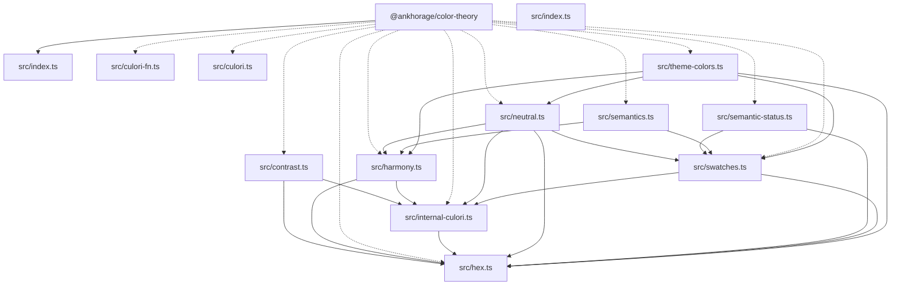

# @ankhorage/color-theory

        

Standalone color theory, harmony, swatch, contrast, and theme color generation utilities.

## Generated documentation

- [Interactive documentation app](././paradox/index.html)
- [Public API reference](././paradox/exports.md)
- [Component registry](././paradox/components.md)
- [Architecture overview](././paradox/diagrams/architecture-overview.mmd)
- [Module relationships](././paradox/diagrams/module-relationships.mmd)
- [Export graph](././paradox/diagrams/export-graph.mmd)
- [Entrypoint sequence](././paradox/diagrams/entrypoint-sequence.mmd)

## Architecture preview

## Path resolution

- Config discovery: searches upward from `process.cwd()` for `paradox.config.ts/js/mjs/cjs` (required; no fallback).
- Package root: defaults to the directory containing `paradox.config.*`; `package.root` (when relative) resolves relative to that directory.
- Output directory: defaults to `paradox/`; `output.dir` (when relative) resolves relative to the resolved package root and must stay inside it.
- Modes:
  - `safe`: writes generated artifacts only under the output directory
  - `write`: additionally updates `<packageRoot>/README.md`

## Public API

### assertHexColor

Assert that a string is a valid six-digit hex color.

- Kind: `function`
- Module: `src/hex.ts`
- Source: `src/hex.ts:34:1`
- Export paths: `src/index.ts`

### COLOR_HARMONIES

`unknown` export.

- Kind: `unknown`
- Module: `src/harmony.ts`
- Source: `src/harmony.ts:4:14`
- Export paths: `src/index.ts`

### COLOR_SWATCH_BASE_STEP

`unknown` export.

- Kind: `unknown`
- Module: `src/swatches.ts`
- Source: `src/swatches.ts:7:14`
- Export paths: `src/index.ts`

### COLOR_SWATCH_STEPS

`unknown` export.

- Kind: `unknown`
- Module: `src/swatches.ts`
- Source: `src/swatches.ts:4:14`
- Export paths: `src/index.ts`

### ColorHarmony

`unknown` export.

- Kind: `unknown`
- Module: `src/harmony.ts`
- Source: `src/harmony.ts:13:1`
- Export paths: `src/index.ts`

### ColorSwatch

`unknown` export.

- Kind: `unknown`
- Module: `src/swatches.ts`
- Source: `src/swatches.ts:9:1`
- Export paths: `src/index.ts`

### ColorSwatchDiagnostics

`type` export.

- Kind: `type`
- Module: `src/swatches.ts`
- Source: `src/swatches.ts:23:1`
- Export paths: `src/index.ts`
- Related symbols: `ColorSwatchWarning`

### ColorSwatchStep

`unknown` export.

- Kind: `unknown`
- Module: `src/swatches.ts`
- Source: `src/swatches.ts:5:1`
- Export paths: `src/index.ts`

### ColorSwatchWarning

`type` export.

- Kind: `type`
- Module: `src/swatches.ts`
- Source: `src/swatches.ts:16:1`
- Export paths: `src/index.ts`
- Related symbols: `ColorSwatchWarningCode`

### ColorSwatchWarningCode

`unknown` export.

- Kind: `unknown`
- Module: `src/swatches.ts`
- Source: `src/swatches.ts:11:1`
- Export paths: `src/index.ts`

### createDefaultSemanticStatusSwatches

`function` export.

- Kind: `function`
- Module: `src/semantic-status.ts`
- Source: `src/semantic-status.ts:44:1`
- Export paths: `src/index.ts`
- Related symbols: `SemanticStatusSwatches`

### createSemanticStatusSwatches

`function` export.

- Kind: `function`
- Module: `src/semantic-status.ts`
- Source: `src/semantic-status.ts:22:1`
- Export paths: `src/index.ts`
- Related symbols: `SemanticStatusSeedInput`, `SemanticStatusSwatches`

### DARK_SEMANTIC_COLOR_REFERENCES

`unknown` export.

- Kind: `unknown`
- Module: `src/semantics.ts`
- Source: `src/semantics.ts:46:14`
- Export paths: `src/index.ts`

### DEFAULT_SEMANTIC_STATUS_COLOR_SEEDS

`unknown` export.

- Kind: `unknown`
- Module: `src/semantic-status.ts`
- Source: `src/semantic-status.ts:6:14`
- Export paths: `src/index.ts`

### DefaultSemanticStatusRole

`unknown` export.

- Kind: `unknown`
- Module: `src/semantic-status.ts`
- Source: `src/semantic-status.ts:12:1`
- Export paths: `src/index.ts`

### generateColorSwatch

Generate a full color swatch and diagnostics from a base color.

- Kind: `function`
- Module: `src/swatches.ts`
- Source: `src/swatches.ts:73:1`
- Export paths: `src/index.ts`
- Related symbols: `ColorSwatch`, `ColorSwatchDiagnostics`, `HexColor`

### GeneratedColorRole

`unknown` export.

- Kind: `unknown`
- Module: `src/harmony.ts`
- Source: `src/harmony.ts:15:1`
- Export paths: `src/index.ts`

### GeneratedHarmonyRoleColor

`type` export.

- Kind: `type`
- Module: `src/harmony.ts`
- Source: `src/harmony.ts:17:1`
- Export paths: `src/index.ts`
- Related symbols: `GeneratedColorRole`, `HexColor`

### GeneratedHarmonyRoleColors

`type` export.

- Kind: `type`
- Module: `src/harmony.ts`
- Source: `src/harmony.ts:24:1`
- Export paths: `src/index.ts`
- Related symbols: `GeneratedHarmonyRoleColor`

### GeneratedNeutralMetadata

`type` export.

- Kind: `type`
- Module: `src/neutral.ts`
- Source: `src/neutral.ts:14:1`
- Export paths: `src/index.ts`
- Related symbols: `ColorSwatchDiagnostics`, `HexColor`

### GeneratedThemeModeColors

`type` export.

- Kind: `type`
- Module: `src/theme-colors.ts`
- Source: `src/theme-colors.ts:25:1`
- Export paths: `src/index.ts`
- Related symbols: `GeneratedHarmonyRoleColors`, `GeneratedNeutralMetadata`, `GeneratedThemeSwatches`

### GeneratedThemeSwatches

`type` export.

- Kind: `type`
- Module: `src/theme-colors.ts`
- Source: `src/theme-colors.ts:17:1`
- Export paths: `src/index.ts`
- Related symbols: `ColorSwatch`

### generateHarmonyRoleColors

Generate role-based harmony colors from a primary color and harmony strategy.

- Kind: `function`
- Module: `src/harmony.ts`
- Source: `src/harmony.ts:54:1`
- Export paths: `src/index.ts`
- Related symbols: `GeneratedHarmonyRoleColors`, `HexColor`

### generateNeutralSwatch

Generate a softly tinted neutral swatch from generated harmony role colors.

- Kind: `function`
- Module: `src/neutral.ts`
- Source: `src/neutral.ts:54:1`
- Export paths: `src/index.ts`
- Related symbols: `GeneratedHarmonyRoleColors`, `NeutralSwatchResult`

### generateThemeColors

Generate light and dark theme color outputs from theme color input.

- Kind: `function`
- Module: `src/theme-colors.ts`
- Source: `src/theme-colors.ts:78:1`
- Export paths: `src/index.ts`
- Related symbols: `GeneratedThemeModeColors`, `ThemeColorInput`

### generateThemeModeColors

Generate harmony role colors, swatches, and neutral metadata for a theme mode.

- Kind: `function`
- Module: `src/theme-colors.ts`
- Source: `src/theme-colors.ts:41:1`
- Export paths: `src/index.ts`
- Related symbols: `GeneratedThemeModeColors`, `ThemeModeColorInput`

### getReadableForeground

Return the readable black or white foreground color with the stronger contrast against a background color.

- Kind: `function`
- Module: `src/contrast.ts`
- Source: `src/contrast.ts:16:1`
- Export paths: `src/index.ts`
- Related symbols: `HexColor`, `ReadableForegroundResult`

### getThemeModePrimaryHex

Parse the primary color configured for a theme mode.

- Kind: `function`
- Module: `src/theme-colors.ts`
- Source: `src/theme-colors.ts:34:1`
- Export paths: `src/index.ts`
- Related symbols: `HexColor`, `ThemeModeColorInput`

### HexColor

`unknown` export.

- Kind: `unknown`
- Module: `src/hex.ts`
- Source: `src/hex.ts:1:1`
- Export paths: `src/index.ts`

### isHexColor

Check whether a string is a valid six-digit hex color.

- Kind: `function`
- Module: `src/hex.ts`
- Source: `src/hex.ts:8:1`
- Export paths: `src/index.ts`

### LIGHT_SEMANTIC_COLOR_REFERENCES

`unknown` export.

- Kind: `unknown`
- Module: `src/semantics.ts`
- Source: `src/semantics.ts:30:14`
- Export paths: `src/index.ts`

### MIN_HUEFUL_CHROMA

`unknown` export.

- Kind: `unknown`
- Module: `src/neutral.ts`
- Source: `src/neutral.ts:6:14`
- Export paths: `src/index.ts`

### NeutralSwatchResult

`type` export.

- Kind: `type`
- Module: `src/neutral.ts`
- Source: `src/neutral.ts:8:1`
- Export paths: `src/index.ts`
- Related symbols: `ColorSwatch`, `ColorSwatchDiagnostics`, `HexColor`

### parseHexColor

Parse a string as a six-digit hex color and return null when it is invalid.

- Kind: `function`
- Module: `src/hex.ts`
- Source: `src/hex.ts:15:1`
- Export paths: `src/index.ts`
- Related symbols: `HexColor`

### parseHexColorOrThrow

Parse a string as a six-digit hex color or throw when it is invalid.

- Kind: `function`
- Module: `src/hex.ts`
- Source: `src/hex.ts:23:1`
- Export paths: `src/index.ts`
- Related symbols: `HexColor`

### ReadableForegroundResult

`type` export.

- Kind: `type`
- Module: `src/contrast.ts`
- Source: `src/contrast.ts:5:1`
- Export paths: `src/index.ts`
- Related symbols: `HexColor`

### SemanticColorReference

`type` export.

- Kind: `type`
- Module: `src/semantics.ts`
- Source: `src/semantics.ts:23:1`
- Export paths: `src/index.ts`
- Related symbols: `SemanticColorRole`

### SemanticColorReferenceMap

`unknown` export.

- Kind: `unknown`
- Module: `src/semantics.ts`
- Source: `src/semantics.ts:28:1`
- Export paths: `src/index.ts`

### SemanticColorRole

`unknown` export.

- Kind: `unknown`
- Module: `src/semantics.ts`
- Source: `src/semantics.ts:21:1`
- Export paths: `src/index.ts`

### SemanticColorToken

`unknown` export.

- Kind: `unknown`
- Module: `src/semantics.ts`
- Source: `src/semantics.ts:6:1`
- Export paths: `src/index.ts`

### SemanticStatusSeedInput

`unknown` export.

- Kind: `unknown`
- Module: `src/semantic-status.ts`
- Source: `src/semantic-status.ts:14:1`
- Export paths: `src/index.ts`

### SemanticStatusSwatches

`type` export.

- Kind: `type`
- Module: `src/semantic-status.ts`
- Source: `src/semantic-status.ts:16:1`
- Export paths: `src/index.ts`
- Related symbols: `ColorSwatch`, `ColorSwatchDiagnostics`, `HexColor`

### ThemeColorInput

`type` export.

- Kind: `type`
- Module: `src/theme-colors.ts`
- Source: `src/theme-colors.ts:12:1`
- Export paths: `src/index.ts`
- Related symbols: `ThemeModeColorInput`

### ThemeColorMode

`unknown` export.

- Kind: `unknown`
- Module: `src/semantics.ts`
- Source: `src/semantics.ts:4:1`
- Export paths: `src/index.ts`

### ThemeModeColorInput

`type` export.

- Kind: `type`
- Module: `src/theme-colors.ts`
- Source: `src/theme-colors.ts:7:1`
- Export paths: `src/index.ts`
