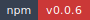
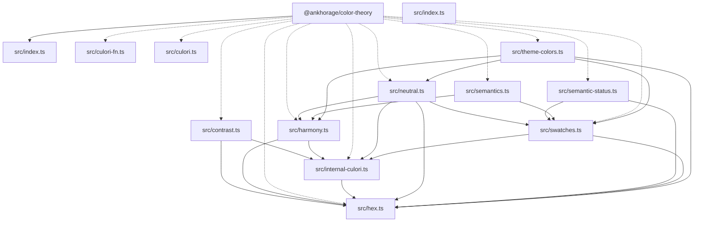

<!-- markdownlint-disable MD013 MD033 -->
<!-- This file is generated by Paradox. Do not edit manually. -->

# @ankhorage/color-theory

        

Standalone color theory, harmony, swatch, contrast, and theme color generation utilities.

## Generated documentation

- [Interactive documentation app](././paradox/index.html)
- [Public API reference](././paradox/exports.md)
- [Component registry](././paradox/components.md)
- [Architecture overview](././paradox/diagrams/architecture-overview.mmd)
- [Module relationships](././paradox/diagrams/module-relationships.mmd)
- [Export graph](././paradox/diagrams/export-graph.mmd)
- [assertHexColor sequence](././paradox/diagrams/sequences/assert-hex-color.mmd)
- [getReadableForeground sequence](././paradox/diagrams/sequences/get-readable-foreground.mmd)
- [getThemeModePrimaryHex sequence](././paradox/diagrams/sequences/get-theme-mode-primary-hex.mmd)
- [parseHexColorOrThrow sequence](././paradox/diagrams/sequences/parse-hex-color-or-throw.mmd)

## Architecture preview

Architecture overview

## Path resolution

- Config discovery: searches upward from `process.cwd()` for `paradox.config.ts/js/mjs/cjs` (required; no fallback).
- Package root: defaults to the directory containing `paradox.config.*`; `package.root` (when relative) resolves relative to that directory.
- Output directory: defaults to `paradox/`; `output.dir` (when relative) resolves relative to the resolved package root and must stay inside it.
- Modes:
  - `safe`: writes generated artifacts only under the output directory
  - `write`: additionally updates `<packageRoot>/README.md`
